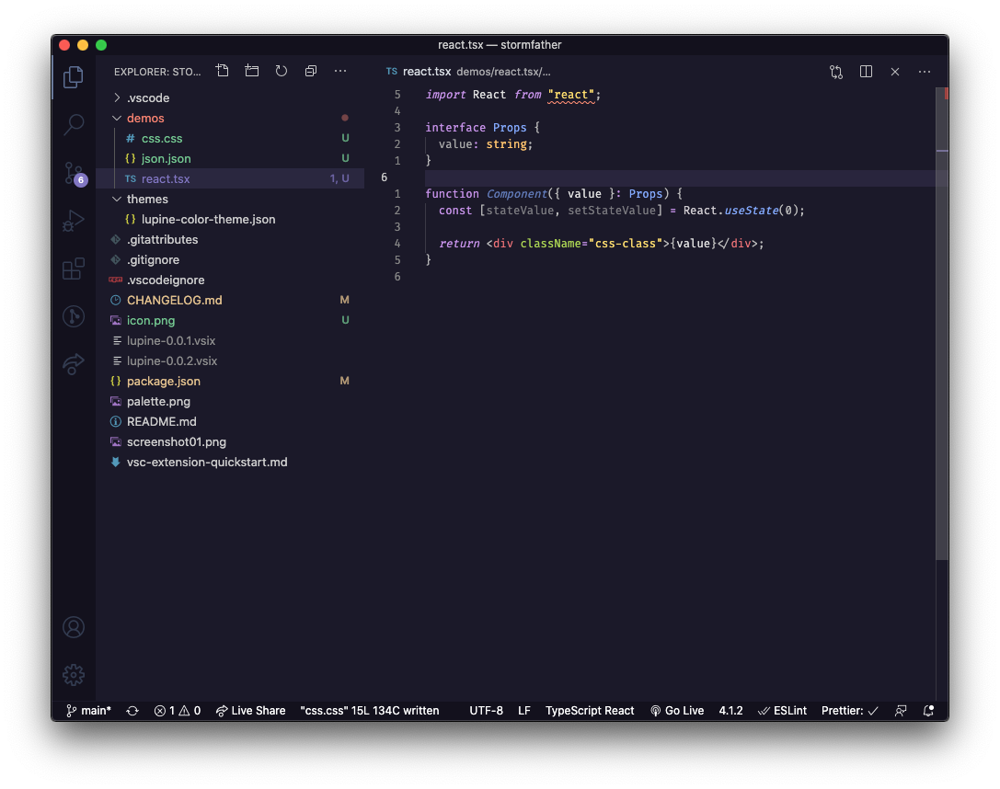

# Lupine

A dark purple theme inspired by Night Owl, Palenight and Nako themes.

# Palette

The syntax highlighting palette consist of 11 colors on a deep purple background.

# Installing

1. Open Visual Studio Code
2. Choose Extensions from menu
3. Search for `lupine`
4. Click Install to install
5. Click Code -> Preferences -> Color Theme -> Lupine

